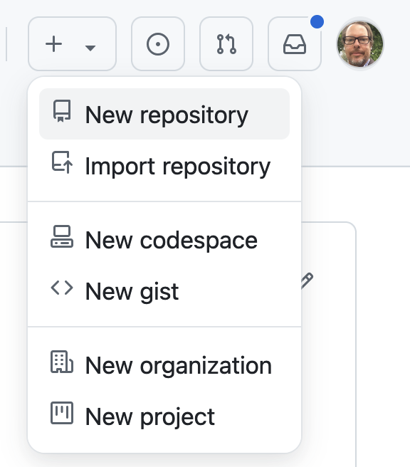

---
teaching: 20
exercises: 0
questions:
----

Let’s start opening your favorite browser and Log in to GitHub, then click on the icon in the top right corner or on the green icon in the top left to create a new repository.

Name your repository “Thesis” and then click “Create Repository”.

::::::::::::::::::: callout
## Add a README file
Note: It is good practice to have “Initialize this repository with a README” checked. 
::::::::::::::::::::

To keep it simple, leave “None” as options for both “Add .gitignore” and “Add a license.” 

For more information about the .gitignore file please go to the lesson number. 

Once you created the repository you will see a page like the one below. 
The repository contains only one readme file 
